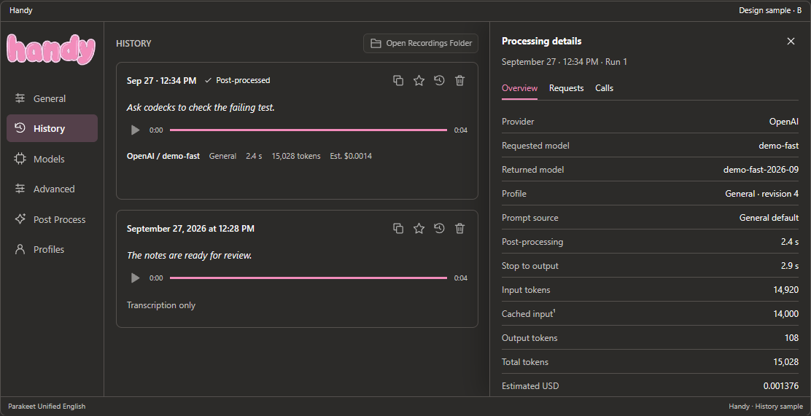
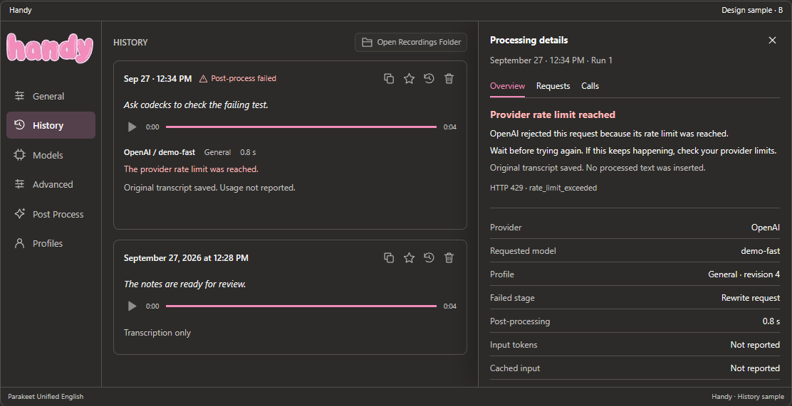
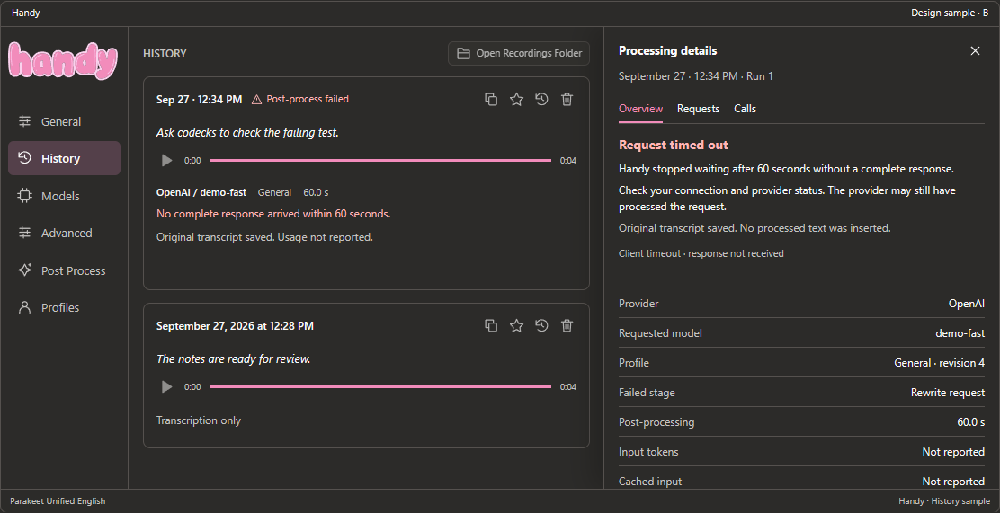
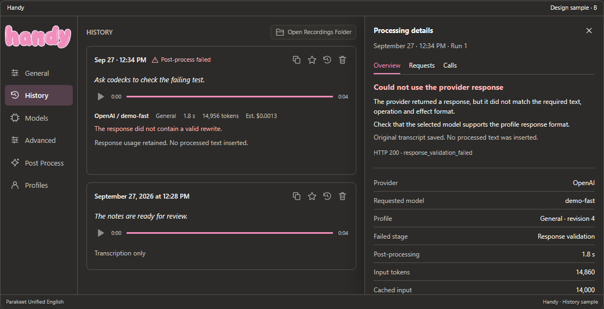
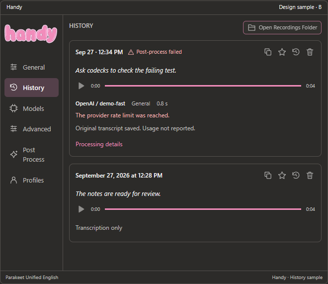

# History: post-processing details

Status: Option B (side inspector) implemented in the development build. Review the [refined design samples](../directions/round-2.html) and [selected behavior record](../directions/round-2.md) for the approved design; the samples remain fictional. Implementation evidence and limits are recorded below and in [H10–H12](../../plan.md#history-implementation-task-graph).

## Purpose and scope

Handy users need to understand what happened after transcription: which provider and model ran, which profile and prompt were used, what changed, how long processing took, how many tokens were reported, and the estimated cost in USD. The existing recording, playback, save, copy and delete controls remain available. The first surface is the History entry, within Handy's existing sidebar and visual style. This is a component-level extension, with read-only inspection of past runs.

The user explicitly requested prompts sent to the provider. This proposal retains their exact message content in a local request archive associated with each history entry. That includes context actually sent, such as a dictionary, memory or selected text. It expands the previous history boundary for this feature; these contents still do not belong in diagnostic logs or recording-widget labels. The archive is described below so this change in retention is explicit.

## Current code and gaps

| Source | Observed behavior | Required change |
| --- | --- | --- |
| [HistorySettings.tsx](../../src/components/settings/history/HistorySettings.tsx) | The entry renders the original transcript and audio controls; Copy copies the original transcript. | Add a compact processing summary and a detail surface. Label original and processed output distinctly. |
| [history.rs](../../src-tauri/src/managers/history.rs) | SQLite migration version 4 stores original text, optional processed text, an optional prompt and a requested flag. | Add persisted runs, calls and optional request snapshots, with lightweight summaries for pagination. |
| [llm_client.rs](../../src-tauri/src/llm_client.rs) | The response parser retains message content only. A request can retry without reasoning fields after a 400/422 rejection. | Return content plus usage, reported model, request ID and per-attempt timing. Capture the actual body of each attempt. |
| [request.rs](../../src-tauri/src/context_profiles/request.rs) | Profile mode can send a synthetic compatibility probe before the real rewrite. Compatibility is cached in memory for the accepted endpoint identity. | Identify probe and rewrite calls separately and include both in the run total when actually sent. |
| [actions.rs](../../src-tauri/src/actions.rs) | The profile path returns no persisted prompt; history is saved before paste; some cancellation paths return before saving. | Carry structured run information through success, failure and cancellation. Update output status after the paste attempt. |
| [commands/history.rs](../../src-tauri/src/commands/history.rs) | Retry updates an entry. Profile retry lacks a captured live target and cannot borrow current context. | Append run records rather than replacing their evidence. Keep profile replay unavailable pending a separate replay design. |

An older entry cannot recover exact prompts, usage, timing or prices from today's settings. Its existing prompt field is a legacy template, not proof of a rendered request.

## Selected design: side inspector

Option B is selected. The post-processing status sits immediately to the right of the entry timestamp, before the existing action icons. Use a compact visible date/time with the full timestamp accessible; let the header wrap when needed without overlapping actions. A successful run says Post-processed. A failed run says Post-process failed with an icon and text, so color is not its only signal.

The details section below the audio keeps provider, profile and measured duration. If a run fails, display its concrete error reason inside this same section, where tokens and estimated cost normally appear. Keep usage and cost when reported; omit unavailable figures from the compact entry and explain their absence in the inspector. The error must be readable without opening the inspector. The original transcript remains visible and copyable.

The inspector opens beside the list in larger windows and fills the History content area in compact windows. Its Overview starts with the failure explanation, suggested next step and output outcome before the metric rows. Requests and Calls remain available. Opening details does not replay the request.

[Open the interactive refinement](../directions/round-2.html). Its sample selector and failure gallery cover success, rate limits, rejected keys, timeout, invalid responses, missing model configuration and older entries. These are standalone mockups; the running app has not been changed. The [original comparison](../directions/round-1.html) is retained as design history.

### Successful post-processing

### Provider rejection

### Timeout

### Invalid response

### Compact entry with the inspector closed

### Error classification and copy

| Condition | Reason shown in entry details | Inspector recovery |
| --- | --- | --- |
| Recognized rate-limit error | The provider rate limit was reached. | Wait before trying again and check provider limits if it persists. |
| Authentication rejection | The provider rejected the API key. | Check the key in Post Process settings. |
| Client timeout | No complete response arrived within 60 seconds. | Check connectivity/provider status. Usage and possible billing remain unknown without a response. |
| Response validation failure | The response did not contain a valid rewrite. | Check support for the profile response format. Retain reported usage and costs. |
| No model selected | Select a post-processing model to run this profile. | Choose a model in Post Process settings. No API request was sent; no provider charge for this run. |
| Unknown provider failure | The provider rejected the request (HTTP status). | Show the safe status and failed stage; do not guess a cause. |

HTTP status alone must not produce an unsupported diagnosis. For example, 429 can mean rate limiting or another provider-specific condition. Add bounded parsing for a small allowlist of provider error codes and map them to translated local messages. Keep unknown cases generic. Do not render or retain raw provider error prose, which may echo input or credentials. Timeout copy uses the actual configured deadline. A client timeout has no fabricated HTTP status.

## Interaction map

Primary flow: open History, scan an entry's processing summary, open Processing details, inspect Overview / Requests / Calls, then close details and return to the same list position. Reading or copying details makes no provider calls.

Three moments must work in every layout: the collapsed successful entry; an open request with long system/user messages; a failed or historical run with incomplete metrics. The board includes success, rate-limit failure and an older entry for each direction.

| Trigger | Result |
| --- | --- |
| Click or Enter/Space on Processing details | Open the selected entry's details. Fetch the archive lazily. |
| Select Overview | Show provider/model, profile, result status, timings, usage and estimated cost. |
| Select Requests | Show the ordered API calls and the exact system/user messages and structured-output schema sent in the selected call. |
| Select Calls | Show each attempt's purpose, outcome, elapsed time and usage. Include retries and compatibility probes. |
| Copy a message or safe request JSON | Copy only that saved content; show a brief confirmation. Credentials are never included. |
| Close details or return to History | Restore focus to the entry's detail trigger and preserve list position. |
| Delete entry or automatic history cleanup | Delete its runs, request archive and audio using the existing retention semantics. |

Use real buttons, tabs with arrow-key navigation and labelled tab panels, selectable text, visible keyboard focus and text labels for status. The side inspector is a non-modal detail region with a labelled close action; at narrow widths it fills the History content area. The trigger uses `aria-expanded` and `aria-controls`. When the inspector covers the list, remove the covered list controls from keyboard navigation until it closes. Escape closes an open detail surface when it owns focus. No hover-only access is required. Copying and inspection never modify the saved request.

Support Handy's 680 x 570 logical-pixel window, larger windows, dark/light themes, long provider/model names, many calls and large prompts. Stack metadata rows at narrow widths. Long text wraps by default; request panes scroll vertically, and Copy includes the complete retained text. Async loading shows a small loading state. A read failure offers Reload details without rerunning processing. No large repeated page heading is added.

## What the entry shows

Keep the original transcript visible and label it Original when processed output exists. Show the processed output on opening details, with separate Copy original / Copy processed actions. The existing list Copy behavior remains original text for this slice. A later change to its default requires an explicit choice.

The collapsed summary shows `OpenAI / model · General · 2.4 s · 15,028 tokens · Est. $0.0014`, wrapping as needed. Long model names truncate with an accessible full label. The summary represents the selected run, initially the latest completed attempt; earlier runs remain inspectable. Provider calls alone determine token and cost totals; local transcription is not counted as LLM usage.

| State | Summary and detail behavior |
| --- | --- |
| No post-processing requested | Transcription only. No invented model, tokens or cost. |
| Running | Processing with elapsed time; completed calls may be inspected. Cancellation records its outcome. |
| Succeeded | Display the processed text and available metrics. Report paste separately as attempted/succeeded according to existing signals. Do not claim the destination accepted text merely because keystrokes were sent. |
| Request failed | Keep the original transcript, provider/model when known, sanitized reason and elapsed time. Usage/cost remain unknown unless the provider reported them. |
| Request succeeded but validation failed | Retain returned usage and estimated cost; show invalid response and no usable processed output. HTTP success does not imply successful processing. |
| Output blocked or failed | Keep the successful rewrite and costs; show that the output was not inserted. |
| Cancelled or interrupted | Preserve completed calls and known usage. A dispatched call with no response has unknown usage; cancellation does not imply zero charge. On restart, reconcile unfinished runs to Interrupted. |
| Older entry | Details not recorded for this entry. Existing original/processed text and legacy template can still be viewed with accurate labels. |
| Provider omitted usage | Tokens: Not reported. Cost: Unavailable. Never display zero as a substitute for missing data. |

## Usage, duration and cost contract

Store provider-reported usage rather than estimating tokens from string length. Normalize input tokens, cached input tokens, output tokens and total tokens as nullable nonnegative integers. Keep supported reasoning/cache-write breakdowns as optional details, with explicit semantics for the provider adapter. Cached input is a subset of input for adapters that declare that relationship; it is never added to input a second time. Reasoning tokens already included in output are not added again. Preserve a bounded usage object for future interpretation, without retaining the whole provider response or hidden reasoning content.

If total tokens are absent but complete input/output values are known, derive total with provenance `derived`; otherwise display Not reported. Aggregate across every actual HTTP attempt in the selected run, including a compatibility check and any retry. When any potentially billable call has missing usage, label the sum Known usage and mark cost incomplete. A compatibility-cache hit is a local skipped-call event and incurs no invented usage. Do not charge a reused compatibility result again. Model-list requests are outside the recording's processing run.

Use monotonic clocks for durations and UTC timestamps for persistence. Request elapsed time spans send through response-body reading or failure. Post-processing elapsed time spans request preparation, compatibility check, rewrite, retries and validation; it excludes recording duration and transcription. Show stop-to-output time separately, and only when measured. Live ASR overlaps recording, so do not present its compute time as an additive stage of post-recording latency. Provider server time is shown only when explicitly supplied with known semantics; client elapsed time is not labelled model inference time.

Cost is an estimate in USD, never a billing claim. Use a versioned rate snapshot with provider, endpoint identity, exact model match, currency, per-million rates, effective date, source and rate provenance. Built-in rate entries require verification against the provider's official price source during implementation; the samples do not establish actual prices. Do not match unknown model aliases by guessing or apply OpenAI rates to a custom proxy. Provider-reported costs, if supported, are labelled separately with their source.

For the simple declared pricing model: `cost_usd = ((input - cached_input) * input_rate + cached_input * cached_rate + output * output_rate) / 1_000_000`. Apply this only when the adapter and rate entry support those categories. If a discounted rate exists but cached usage was omitted, or tier/context length/service-class pricing cannot be resolved, show Cost unavailable rather than assuming a cache hit count. Providers with separate cache-write or other billing categories need their own explicit rate rules. Use decimal arithmetic, retain more precision than displayed, round once for display, and show `< $0.0001` for a nonzero sub-display amount. Store the rate and computed estimate used at the time; later price changes must not silently rewrite history. Unknown prices do not block transcription or processing.

For the board's fictional example, the rewrite reports 14,860 input tokens (14,000 cached) and 96 output tokens; a probe adds 60 input and 12 output tokens. The combined total is 15,028 tokens. Fictional per-million rates of $0.50 input, $0.05 cached input and $2.00 output produce $0.001376, displayed as Est. $0.0014. These figures demonstrate presentation and arithmetic, not measured performance or a real model's price.

## Exact requests and local retention

Capture a snapshot at the HTTP serialization boundary for each attempt: ordered message roles/content, requested model, response-format schema and supported generation parameters actually sent. Keep the effective profile ID/name/revision and prompt source (General, inherited or override) on the run. Show returned model ID separately when it differs. The original prompt template may be stored as labelled provenance; it never replaces the rendered messages. Settings changes and profile deletion must not change an earlier run's display.

The prompt archive is local to `history.db` and follows existing saved-entry and cleanup rules. Save request contents in history is enabled for new runs, with a short explanation that sent application context is included. Turning it off stops storing future request bodies and prompt templates while retaining metadata and transcript history; it does not erase existing archives. Clear saved request contents deletes archived bodies and templates while retaining transcripts and metrics. Provider response prose is not archived; validated output and bounded response metadata are retained separately.

Never store API keys, authorization headers, cookies, private native target tokens, credential-bearing URLs or arbitrary error bodies. Store a safe endpoint label/host and provider ID; strip URL userinfo, query and fragment. Request contents can contain user-provided sensitive text, so this feature must not claim automatic secret redaction or encryption at rest. Protected fields remain excluded by the capture layer before request assembly. Render archived messages as plain text, never executable HTML or instructions. Copy request JSON produces a safe body only. Full response bodies and model reasoning traces are outside this slice; retain the final text, validated action and bounded usage metadata.

Proposed archive ceiling: 1 MiB of UTF-8 safe request JSON per HTTP attempt. Larger requests may still be sent under their existing provider limits, but their archive records `omitted_too_large`; never label a truncated archive Exact request. Loading, showing and copying large retained messages must stay bounded. UI preview truncation is permitted only with Show full message and complete copy semantics. History list queries must not load these blobs.

## Persistence and integration proposal

Use additive SQLite migrations, retaining existing entry fields and IDs. Add `history_processing_runs` (one entry to many runs), `history_provider_calls` (one run to many attempts) and an optional `history_request_contents` table keyed by call ID. Foreign-key cascades require `PRAGMA foreign_keys=ON` on every connection, including cleanup connections; verify this rather than relying on declarations alone. A run stores its own transcript/output snapshot so retrying an entry does not relabel an older run's result. Entry summaries reference the latest run while older run records remain readable.

| Record | Required data |
| --- | --- |
| Run | Stable run ID, history entry ID, session ID, timestamps, status, profile/prompt-source snapshot, original/processed text, elapsed durations, output outcome, latest safe error, metadata schema version. |
| Provider call | Stable call ID, run ID, ordinal, purpose (compatibility/rewrite), retry relationship, provider label/ID, safe endpoint, requested and reported model, start/end times, duration, HTTP status, outcome, optional provider request ID, usage and completeness, price snapshot and cost estimate. |
| Request contents | Call ID, safe serialized body, byte count, archive status (retained/disabled/cleared/omitted-too-large/not-recorded), optional labelled template provenance. |

Create/update the history entry and processing run once a valid transcript and recording are available, before provider work. Attach observations to explicit run IDs, not a mutable global current run. Finalize on success, error, timeout and cancellation; interrupted rows remain recoverable on restart. A task-scoped observer must record a started HTTP attempt even when the enclosing future is cancelled before receiving a response. Updates must be idempotent and must not recreate entries deleted while processing. Metadata persistence failure surfaces as Details could not be saved and does not discard usable transcription output or claim that an archive exists.

The shared LLM client records observations through task-scoped run and call guards, including on errors and dropped futures. Compatibility wrappers remain for text-only callers. Request IDs, errors, usage and archive retention are collected in the shared client; profile resolution and probe purpose are supplied by the caller. This keeps observations independent of content parsing and preserves each actual attempt during retries.

Expose paginated lightweight run summaries with `get_history_entries`, and lazy commands for run detail and request contents. Keep persisted secret-bearing settings outside all response types. Regenerate Specta bindings; add i18next strings for every new app label. Update `HistoryUpdatePayload` so an open detail view can follow completion without resetting selection or scrolling.

This slice does not add prompt replay, captured-context reuse, a model picker in History, automatic learning, new provider protocols, spending dashboards or a live price-fetching service. Existing profile retry remains unavailable with an explicit explanation. Ordinary retry can append a new run using its current supported behavior; label its settings snapshot and preserve prior attempts.

## Acceptance and verification

- Migrate a version-4 database without changing IDs, saved flags, audio references or text. Legacy entries show unavailable metrics rather than guessed values.
- Exercise plain transcription, ordinary post-processing and profile processing, including a probe miss/hit, reasoning-parameter retry, failed HTTP response, missing usage, malformed content, timeout, cancellation, output blocked and interruption/restart.
- Verify provider/model/profile snapshots and exact sent messages against a local mock endpoint. An archive of a retry must reflect changed parameters. No inspection action makes an HTTP request.
- Verify known/unknown/partial usage, cache subset arithmetic, reasoning breakdowns, rate precision, unknown model/rate handling and unchanged historical estimates after updating rates. Check the fictional $0.001376 fixture.
- Confirm all calls attach to the correct run under overlapping completion/cancellation, retries do not overwrite old evidence, and deleting an entry while work finishes cannot resurrect its archive.
- Exercise manual deletion, count/time cleanup, saved-entry retention, Clear saved request contents and archive-disabled/oversize states. Check that child rows are removed and unrelated entries survive.
- Verify excluded headers/URL credentials/target tokens never enter the archive, frontend events or logs. Treat malicious archived text as inert selectable text.
- Verify the selected inspector and its entry header/error summary at 680 x 570 and a larger window, dark/light themes, keyboard-only navigation, long messages/model IDs, focus restoration, screen-reader labels, loading/reload errors and prompt-copy fidelity.
- Before release, run a native recording through a configured endpoint, compare the recorded calls and usage with its response, open History, and verify that the saved request and displayed status match that run. Browser fixtures alone cannot prove the native path.

## Decisions for review

1. Layout settled: B Side inspector, with status next to the time and failure reasons in the entry details section. The samples document five failure cases; no further layout selection is required.
2. Request retention is on for new runs, with an opt-out and clear-archive control. Exact prompts include the context sent.
3. USD estimates depend on a verified rate entry. Initial support covers the exact `gpt-6-luna` model at OpenAI's direct global endpoint with Standard service and complete usage categories. Other models, proxies and service tiers show unavailable cost. See the [pricing source record](../history-pricing-sources.md).

## Design verification

`node scripts/verify-history-refinement.mjs` passes using installed Edge for the selected design: header position, error inside the metadata section, all five failure cases, request/call distinctions, closed-inspector visibility, gallery selection, Escape/focus restoration and compact dark/light layouts. Evidence is in `design/directions/proof/round-2/`.

The original comparison check, `node scripts/verify-history-design.mjs`, also passed using installed Edge. It checks all three options, success/failure/legacy states, request-call selection, tab keyboard navigation, Escape/focus restoration, no horizontal overflow at 680 pixels in both themes and no page errors. Screenshots and the check record are in `design/directions/proof/`. These checks validate the mockups only; implementation checks are separate.

## Implementation verification

The Rust suite passed 313 tests, including version-4 migration, lifecycle/cancellation, deleted-ID isolation, local HTTP retry observations, exact request archive comparisons, usage/error normalization, archive controls, decimal pricing and blocked-output preservation. The development app was rebuilt and upgraded its preserved portable database to version 5.

`node scripts/verify-history-native.mjs` exercises native transcription of a synthetic speech recording through a local HTTP fixture, then checks persisted runs and the real History WebView. It covers success, HTTP 429, archive opt-out and malformed HTTP 200 with retained reported usage. Fixtures are removed and endpoint/settings restored after the run. Evidence is in `design/proof/history-native/`.

This verification uses synthetic speech and a local endpoint, not a paid OpenAI request or live microphone recording. Price calculations are tested against stored rates; they are estimates, not bill reconciliation. New translation keys exist in all locales, with English text awaiting translation. Native macOS/Linux behavior and assistive-technology operation have not been exercised. Existing entries cannot recover usage or exact requests that were never recorded.
