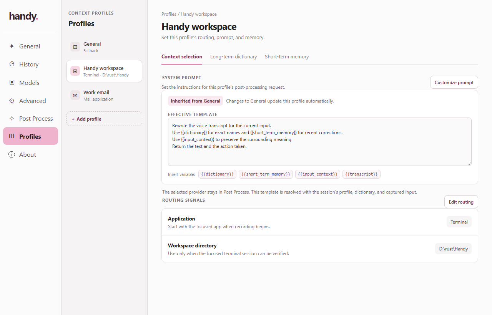
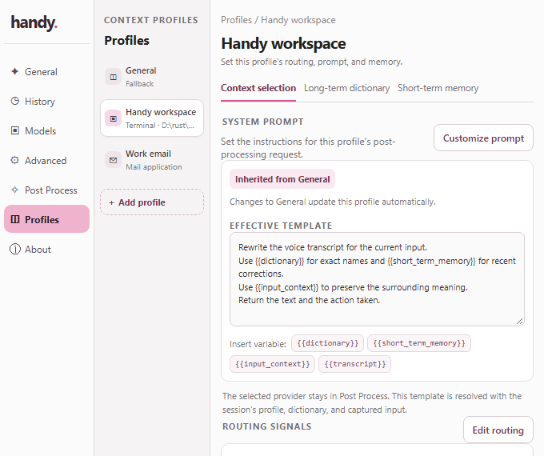
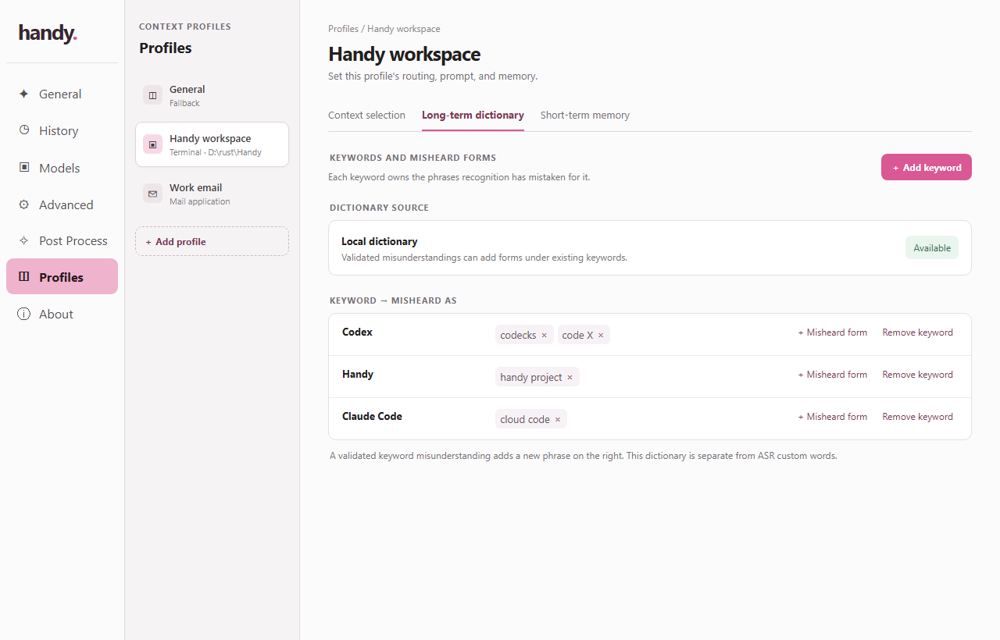
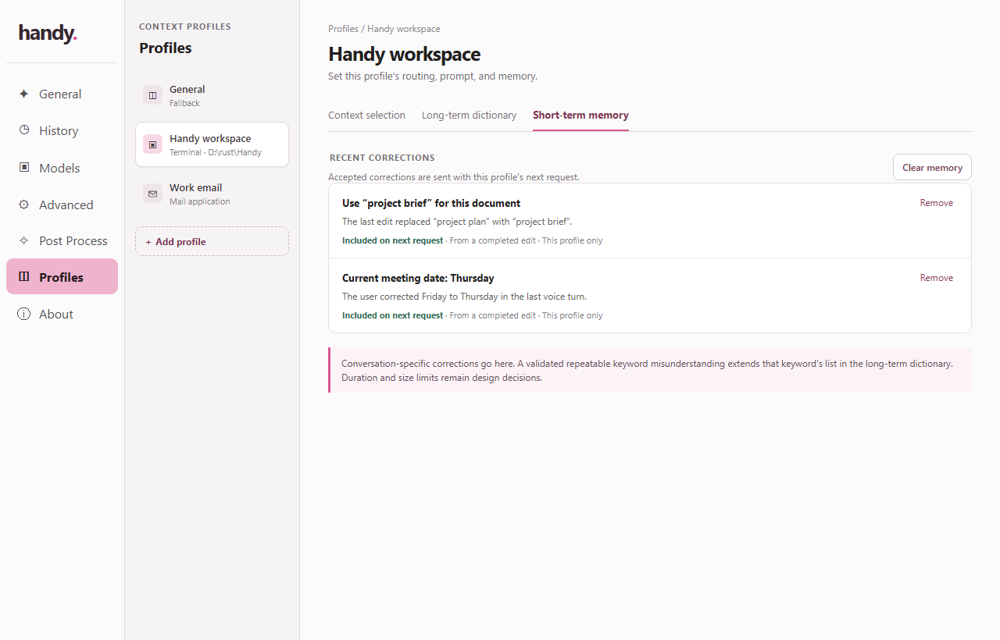
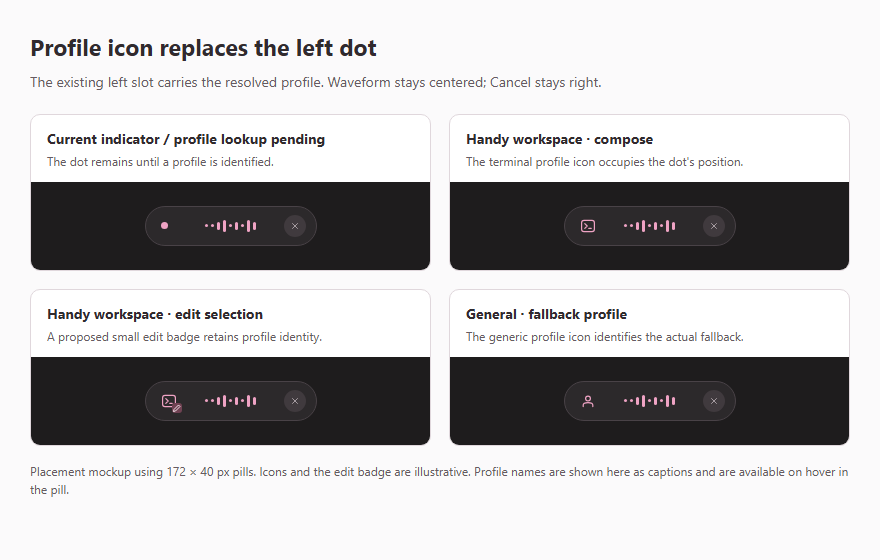

# Context profiles: specification

Status: Draft product and integration specification. This replaces the earlier model-hosting proposal. [Intent](intent.md) states the goal; the [implementation plan](plan.md) maps it to the current code. Implementation is underway; task status and verification are recorded in plan.md.

Message design update: [Profile processing messages](design/components/processing-messages.md) defines New message, Continue message and Edit selection requests. It places the selected profile's dictionary in its configured system prompt and sends readable task guidance, marked input context, memory and dictation in the user message. That specification supersedes earlier serialization and profile-inheritance requirements below where they conflict; implementation is pending.

Proposed extension: [History post-processing details](design/components/history-post-processing.md) specifies provider/model snapshots, token usage, timings, estimated USD cost and the exact requests sent. The selected [side inspector design](design/directions/round-2.html) places processing status beside the timestamp and failure reasons in the entry details section. The extension explicitly defines a local request archive, including sent context, beyond the original history scope; it is not implemented yet.

## Scope and existing integration

Handy will create a context request for its existing post-processing path. This feature owns profile settings, app-specific context resolution, the recording-widget profile state, long-term dictionary snapshots, short-term memory snapshots, and a feedback hook for accepted corrections. It does not host a text model or add a second inference path. Provider calls, response insertion, and history remain in Handy's existing post-processing flow, with contract changes needed to carry the richer request and two-part result.

Today, [`Sidebar.tsx`](src/components/Sidebar.tsx) shows the Post Process section when `post_process_enabled` is true. [`PostProcessingSettings.tsx`](src/components/settings/post-processing/PostProcessingSettings.tsx) owns provider and prompt controls for existing post-processing. [`RecordingOverlay.tsx`](src/overlay/RecordingOverlay.tsx) receives recording-state events but no profile or selection state. [`actions.rs`](src-tauri/src/actions.rs) runs transcription and post-processing, while [`llm_client.rs`](src-tauri/src/llm_client.rs) sends HTTP chat-completion requests. The current structured response schema contains only `transcription`; malformed structured output can fall back to raw text or the legacy request path. The Custom provider currently advertises no structured-output support, and Apple Intelligence uses a native local path. Profile mode therefore needs an explicit compatibility check and stricter parsing than the current text-only path. Existing `custom_words` in [`settings.rs`](src-tauri/src/settings.rs) assists speech recognition and remains separate from profile dictionaries.

## Settings and navigation

Add `post_process_profiles: bool`, default `false`. Enabling it requires `post_process_enabled`; turning off post-processing clears it. Profile setup is local and does not require a provider, model, API key, network access, or compatibility probe. Validate endpoint readiness and compatibility when processing a request. The Post Process section remains visible while post-processing is enabled. A Profiles section appears only when both flags are enabled. The profile toggle belongs in Post Process settings. The selected provider remains there; while profile mode is active, Context selection owns the effective system prompt template for each profile.

Profiles is a settings page with three levels of navigation: Handy's existing left sidebar selects Profiles; a left sub-menu within Profiles selects one of several profiles or adds a profile; the detail area shows the selected profile's three tabs. The selected profile owns all data shown in those tabs. Switching profiles must not mix routing rules, stable entries, or short-term memories. A new profile is a draft until it has a name and a usable routing rule; the exact creation form and save behavior remain open.

| Tab                  | Purpose                                                                                             | Main controls and state                                                                                                                                                                                                                                           |
| -------------------- | --------------------------------------------------------------------------------------------------- | ----------------------------------------------------------------------------------------------------------------------------------------------------------------------------------------------------------------------------------------------------------------- |
| Context selection    | Choose how Handy recognizes this profile and what system prompt it sends.                           | A prompt template editor with source state (General default, inherited from General, or custom override), supported placeholder controls, and application/workspace match signals. Fallback follows the matching order implicitly and has no per-profile control. |
| Long-term dictionary | Maintain canonical keywords and their observed misheard forms for this profile.                     | Dictionary source and status; add/remove keyword; show the keyword on the left and its list of misheard forms on the right; add/remove a form and show conflicts. Validated keyword misunderstandings can extend an existing list.                                |
| Short-term memory    | Show recent conversation-specific corrections that will be included in this profile's next request. | Memory item, origin and inclusion state, remove one, clear all. Memory is separate from keyword misunderstandings; retention limits remain open.                                                                                                                  |

The mockups use synthetic names and entries and inherit Handy's light palette, narrow main sidebar, and rounded settings groups. They show layout and behavior, not implemented screens. The [interactive mockup](design/mockups/context-profiles.html) allows switching profiles and tabs, editing or inheriting a system prompt, adding a draft profile, editing routing fields and stable entries, and removing short-term memories. Changes in this standalone mockup are in memory only. The static views below can be reviewed within this spec.

### Context selection mockup



The selected profile appears in the left sub-menu. Context selection leads with the effective system prompt and clearly marks its source. The screenshot shows Handy workspace inheriting General's default. Selecting General shows the editable default; selecting a profile with its own prompt shows a custom state. An inherited template is read-only until Customize prompt creates an editable copy. Saving creates an override for that profile; Use General prompt instead removes the override. Edits to General affect inheriting profiles on their next voice session, while an already started session keeps its prompt snapshot. The [prompt behavior record](design/components/profile-system-prompt.md) covers the control states and keyboard behavior; the [General default](design/mockups/context-general.png) and [custom override](design/mockups/context-custom.png) views show the other states.

The template uses Mustache-style placeholders such as `{{dictionary}}`, `{{short_term_memory}}`, `{{input_context}}`, and `{{transcript}}`. The editor lists the supported names and rejects unknown or unclosed placeholders. Request assembly resolves them once from the frozen session snapshot with explicit labels and bounds; captured application text remains data and cannot change message roles or become template source. Exact serialization and missing-value text need endpoint tests. The selected provider stays in Post Process. General must have a usable default: a proposed first-run rule copies the effective currently selected Post Process prompt into General once, applying the existing `${output}` removal in [`actions.rs`](src-tauri/src/actions.rs) because Handy already sends the transcript separately. General is then edited independently. If that prompt is unavailable, profile mode asks for a General default before it can run.

Routing signals remain below the prompt editor. If workspace detection fails, Handy continues through the normal match order without a separate fallback setting. App-specific resolvers may provide different signals; a terminal workspace is a sample, not a universal requirement. The profile and edit/compose indicators still belong in the recording widget during a voice session; they are no longer presented as settings-page previews.

Handy's main settings window starts at `680 × 570` logical pixels in [`lib.rs`](src-tauri/src/lib.rs). The mockup therefore also has a compact layout at that width; the detail pane scrolls while the three tabs remain reachable. The [compact dictionary](design/mockups/dictionary-compact.png) and [compact memory](design/mockups/memory-compact.png) views use the same layout.



### Long-term dictionary mockup



The dictionary belongs to the selected profile. Each row has a canonical keyword on the left, such as `Codex` or `Claude Code`, and a list of phrases it was misheard as on the right, such as `codecks` or `cloud code`. Users manage the keyword's misheard forms here; automatic corrections enter short-term memory. Exact IDs, source providers, duplicate and collision rules, and whether entries can be shared across profiles remain open. Existing ASR `custom_words` are not silently converted or overwritten.

### Short-term memory mockup



Accepted conversation-specific corrections appear only under the profile that produced them and are marked for inclusion on that profile's next request. A user can remove one memory or clear the profile's memories. A model response proposes a correction; Handy validates its shape and verifies the field change before adding it to short-term memory. The automatic correction policy below defines memory lifetime and bounds.

## Voice-session behavior

1. At session start, before the destination loses focus, capture the source application and available focused-input state. Report selected text, caret, and bounded surrounding text as present, empty, unavailable, or uncertain. Exclude protected input content.
2. Resolve a profile from available application-specific signals. For a terminal, prefer a verified workspace directory when a rule requires it; do not infer a directory from an unrelated tab or process. Apply explicit rule precedence and a fallback. Snapshot the profile, effective system prompt and its source/revision, long-term dictionary, and short-term memory for this session.
3. Send a session-scoped display event to the recording widget as soon as the profile is resolved. Replace the pink dot at the far left with the resolved profile's icon in the existing left slot; do not add an icon beside a retained dot. Give it a tooltip and accessible name identifying the profile and input mode, with a short visible name where space permits. Show a distinct edit indicator for a verified nonempty selection. Preserve microphone readiness independently of profile resolution. Use a fallback or unknown label when routing is uncertain. Keep private field text and full paths out of the compact widget.
4. After transcription, assemble one request with the transcript, resolved profile identity and match basis, effective prompt template, stable dictionary entries, short-term memory, and permitted input context. Resolve supported template placeholders against the session snapshot while preserving the boundary between instructions and text captured from another application. Hand the request to the configured post-processing endpoint.
5. The endpoint returns corrected text and a separate proposed short-term memory effect. Handy applies the text through the existing output path, then reads the supported field back. Admit the correction to the originating profile's short-term memory only when the expected field change is verified. Failed, cancelled, stale, or unverifiable output adds nothing. The next request for that profile includes the accepted memory. Long-term dictionary entries remain manually managed.

The widget and request must use the same profile and prompt snapshot even if settings or focus change during recording. A late response from an older session cannot add memory to a different profile. The context layer uses the provider selected in Post Process and the effective prompt from the resolved profile.

### Recording widget placement

The requested location is the existing `.sdot` in `listeningRow` in [`RecordingOverlay.tsx`](src/overlay/RecordingOverlay.tsx). Its `.sbase-l` container is shared by compact and Live recording. The icon takes that position while the waveform remains centered and Cancel stays at the right. The [widget placement sample](design/mockups/recording-profile.html) shows the replacement and a proposed small edit badge; the badge's exact appearance is a design detail, while the far-left replacement is settled.



Use the existing dot while profile lookup is pending or profile mode is off. Once resolved, a matching profile icon takes its place; General uses a recognizable generic profile icon. A missing icon asset uses the generic icon with the resolved profile's name. The icon remains neutral while the microphone is arming and gains the recording treatment only when capture is ready. Reset profile state on cancellation, hide, and a new session so an old icon cannot appear on a later recording. Transcribing and processing already use a spinner in the same slot; preserve the working-state behavior and the session's profile data through that transition. Native window bounds and CSS must agree before adding any label or edit badge.

## Request and feedback contracts

| Contract                      | Required fields or invariant                                                                                                                                                                                                                                                                                                                                                                                                                                                                                                |
| ----------------------------- | --------------------------------------------------------------------------------------------------------------------------------------------------------------------------------------------------------------------------------------------------------------------------------------------------------------------------------------------------------------------------------------------------------------------------------------------------------------------------------------------------------------------------- |
| Session context               | Session ID, captured application and input state, resolved profile ID, match basis and confidence/availability, fixed profile revision, and effective prompt source and revision. The private insertion target remains outside the endpoint payload.                                                                                                                                                                                                                                                                        |
| Long-term dictionary snapshot | Dictionary ID and revision, selected bounded entries where each canonical keyword is the key and its observed misheard phrases are the values. Entries do not change mid-request.                                                                                                                                                                                                                                                                                                                                           |
| Short-term memory snapshot    | Profile ID, bounded accepted correction items, source session/action IDs, and ordering. Only this profile's memories are included.                                                                                                                                                                                                                                                                                                                                                                                          |
| Post-processing request       | Transcript, effective profile system prompt template, profile metadata, long-term dictionary, short-term memory, and permitted input context as distinct fields or message sections. Missing context is explicit; unknown or malformed placeholders fail before the endpoint call.                                                                                                                                                                                                                                          |
| Post-processing result        | Predicted text plus an action description. The action reports the intended text operation (`insert` or `replace_selection`) and an effect: `none`, proposed `add_misheard_form` for an existing keyword, or proposed conversation-specific memory. Handy's captured selection and verified insertion outcome are authoritative; a model cannot choose a different destination or claim that a write succeeded. Handy attaches the source session and profile to a validated proposal; model-supplied IDs are never trusted. |

The endpoint must be capable of returning the two-part result when profiles are enabled. Profile mode must not treat malformed JSON, missing action fields, or a structured-output rejection as ordinary processed text; it must report a typed failure and apply an explicit fallback policy. If a configured provider cannot honor the required request or result format, Handy must surface that incompatibility rather than silently dropping context or accepting an unvalidated memory proposal. Existing post-processing behavior when profiles are disabled remains unchanged. Apple Intelligence is outside the endpoint-only profile path unless a compatible endpoint contract is added for it.

### Automatic correction policy (2026-10-01)

The model returns both corrected text and a separate memory proposal. Handy adds an accepted correction to the originating profile's short-term memory only after reading back the expected field change. A correction need not match an existing dictionary keyword. For selected text `bomb` and the spoken request "thats not bomb its BOM from bill of materials", the response is:

```json
{
  "text": "BOM",
  "operation": "replace_selection",
  "effect": {
    "type": "remember",
    "text": "Use BOM (bill of materials) when bomb refers to this term."
  }
}
```

The model should propose concise, explicit terminology or factual corrections. An ordinary rewrite or a change of mind uses `{"type":"none"}`. Reference text does not authorize new memories. Semantic classification is performed by the model; Handy validates the response shape, bounds, session, profile, and completed output.

The legacy `add_misheard_form` effect remains accepted for compatibility. Handy requires an existing keyword ID, an observed phrase from the transcript or selection, the canonical term in the result, and no conflicting keyword mapping. An accepted proposal becomes a short-term memory instruction. It never changes the long-term dictionary.

Verification requires complete captured field text, exact local UTF-16 selection/caret positions, the same native target, the expected full field contents after output, and a collapsed selection at the expected caret. Positions remain local and are excluded from endpoint data. The background verifier allows up to one second for readback attempts after successful dispatch; each capture has its existing 250 ms budget. No-paste output, unchanged text, unsupported controls, truncation, changed focus, cancellation, newer sessions, and stale/deleted profiles cannot admit memory. The existing append-trailing-space setting is included in the expected result. Automatic submission that clears the field cannot be verified and adds no memory.

Current verification supports Windows native Edit controls. Browser editors, Windows Terminal, and other unsupported input controls do not learn automatically. This limitation does not change application-based profile routing.

Memory lasts until Handy exits. Each profile retains at most 20 corrections and 6,000 Unicode characters in total, with at most 500 characters per correction; older entries are evicted first. Exact normalized duplicates and repeated session delivery are ignored. Removing or clearing an entry invalidates older in-flight memory proposals for that profile. Accepted memory refreshes the profile's Short-term memory tab and appears in the next request. Failed verification does not affect the existing corrected-text output or imply that the proposed effect in History was applied.

## Data handling and failure states

Keep captured field text and workspace context bounded and session-scoped. Do not put them in ordinary logs, history, or widget labels. Show when an external endpoint will receive them. The memory UI lets users inspect, remove, or clear corrections; the process lifetime and bounds are specified above.

If context capture is unsupported or incomplete, show a truthful fallback in the widget and request. If profile matching is ambiguous, use a documented precedence rule or fallback; do not display a specific profile that was not resolved. If a dictionary source is unavailable, expose that state on the dictionary tab and use the chosen failure policy. If the endpoint returns malformed action data, update neither dictionary nor short-term memory. Existing transcription and post-processing fallback behavior remains subject to the separate provider policy.

## Gaps and recommended defaults

These are recommendations for decisions still open, not settled behavior. They make the mockup and implementation contract reviewable without implying that every application or provider already supports them.

| ID  | Gap                                | Recommended default                                                                                                                                                                                                                                                                                                                                                                                                     | Why it matters                                                                                                                  |
| --- | ---------------------------------- | ----------------------------------------------------------------------------------------------------------------------------------------------------------------------------------------------------------------------------------------------------------------------------------------------------------------------------------------------------------------------------------------------------------------------- | ------------------------------------------------------------------------------------------------------------------------------- |
| R1  | Profile match precedence           | Prefer a verified workspace-specific rule, then an application rule, then General. This fallback is implicit; do not add a per-profile fallback field or treat selecting a profile in settings as a manual override for the next voice session.                                                                                                                                                                         | A settings editor choice should not silently change routing. The widget can state which rule won.                               |
| R2  | Terminal workspace evidence        | Support only terminal integrations that can tie a directory to the focused tab or input. Otherwise use the terminal or General fallback; do not route from a window title or a neighboring process alone.                                                                                                                                                                                                               | The wrong workspace can select the wrong dictionary and send unrelated context.                                                 |
| R3  | Context limits and disclosure      | Bound selected text and surrounding text separately, mark truncation, exclude protected fields, and show the selected endpoint's context-transfer setting before enabling Profiles. Set exact limits from real target-control measurements.                                                                                                                                                                             | Selection may be larger than the excerpt; both cost and privacy need predictable limits.                                        |
| R4  | Memory lifetime                    | Start with profile-local memory held in process, a small fixed item and token budget, expiry after inactivity, and Remove/Clear controls. Keep persistence across restarts off until a retention policy is chosen.                                                                                                                                                                                                      | Short-term memory should help the next requests without becoming an unbounded private history.                                  |
| R5  | Memory admission                   | Accept a proposed correction only after strict schema validation, a matching session and profile, a completed text operation, deduplication, and content bounds. Show it immediately in Short-term memory and allow removal.                                                                                                                                                                                            | A model can suggest a correction but cannot prove where text was inserted or that the user intended a durable rule.             |
| R6  | Provider compatibility             | Allow local profile setup before endpoint configuration. Validate the chosen model and endpoint against the two-part schema when processing a request; report incompatible providers there. Do not use the legacy raw-text fallback in profile mode.                                                                                                                                                        | Handy's current provider capability flag is coarse, and the legacy path can return text without an action.                      |
| R7  | Failed edit requests               | If processing fails in edit mode, leave the selected text untouched and surface a recoverable result. Keep the existing transcript fallback only where it is known to be safe.                                                                                                                                                                                                                                          | Pasting raw speech over selected text can destroy the user's original passage.                                                  |
| R8  | Widget timing and size             | Start recording without waiting for a slow resolver. Use the current dot during lookup, then replace it in place with the resolved profile icon. Identify lookup state, profile, and input mode through accessible text and a tooltip; use a short visible name where it fits. Verify readiness, edit indication, compact/Live layouts, and native overlay bounds.                                                      | The left dot already communicates microphone readiness; profile identity must preserve that feedback and fit the existing pill. |
| R9  | Dictionary ownership               | Keep one long-term dictionary per profile at first. Add shared sources only after conflict and update ownership rules are specified.                                                                                                                                                                                                                                                                                    | The current mockup presents each profile's data as isolated, and sharing changes edit semantics.                                |
| R10 | Keyword misunderstanding admission | Validate legacy keyword proposals against an existing keyword and observed phrase, then store the correction in short-term memory after verified field readback. Reject conflicting mappings; long-term entries remain manually managed.                                                                                                                                                         | Automatic feedback must not silently change stable keyword mappings.                                   |
| R11 | Prompt inheritance and rendering   | Require an editable General default. Let other profiles store either no prompt override or a custom template. Show the source beside the effective template. Start with a small named-placeholder set and reject unknown or unclosed expressions; do not enable arbitrary helpers or template code. Initialize General from the selected Post Process prompt once if one exists, applying current `${output}` handling. | Users can see which instructions a session will use, and untrusted context cannot execute template logic.                       |

The two most consequential choices are R2 and R6: unreliable terminal routing can send the wrong workspace context, while an incompatible endpoint cannot fulfill the required action contract. Both need a real integration test before the UI promises support.

## Acceptance criteria

- The Profiles page supports multiple isolated profiles, a left profile selector, an add-profile entry point, and exactly three per-profile tabs: Context selection, Long-term dictionary, and Short-term memory.
- Context selection shows General's editable default, a visibly inherited prompt for profiles without an override, and a custom prompt state with a reset-to-General action. Changing General updates the next request for an inheriting profile but does not alter an override or an active session. Invalid placeholders block save or request handoff with a clear error.
- The Profiles section is visible only when both flags are enabled. Turning off post-processing clears `post_process_profiles` and hides Profiles without deleting profile data.
- At voice-session start, the resolved profile's icon replaces the pink dot in the far-left recording slot in both compact and Live modes. The widget distinguishes verified selected-text editing from composing new text and retains microphone readiness feedback. The displayed profile matches the eventual request snapshot; missing assets and unavailable context have truthful fallbacks.
- Two profiles with different routing rules, stable entries, and short-term memories produce distinct requests. Unavailable workspace or accessibility data remains explicit.
- A validated conversation-specific correction from a completed post-processing action appears in the originating profile's short-term memory and is included in its next request. Removing or clearing memory excludes it from later requests.
- A validated keyword misunderstanding adds a correction to the originating profile's short-term memory after verified field readback; a cancelled, failed, malformed, duplicate, or conflicting action adds nothing. Automatic feedback cannot create or modify long-term keyword mappings. The current ASR `custom_words` behavior remains available.
- The request goes through Handy's configured post-processing endpoint. No local text-model lifecycle is added by this feature.

## Decisions still open

1. Which apps and terminal environments can provide a verified workspace in the first release, and what exact precedence should apply among matching rules?
2. What stable keyword ID and phrase metadata, source ownership, sharing, collision policy, and new-profile defaults are required? The visible entry shape is settled as canonical keyword on the left and misheard forms on the right.
3. How much input text may be captured, which external-transfer default applies, and what should the widget show when capture is partial?
4. Resolved for this delivery: short-term memory uses the bounds and verified field-readback policy above. Long-term entries remain manually managed.
5. Which existing providers support the two-part result, and what user-visible behavior applies when the selected provider does not?
6. What exact placeholder values and missing-value markers should the renderer send, and should General be seeded once from the selected Post Process prompt or remain linked to that prompt until the user edits it?

## First-release decisions (2026-09-27)

The user selected Windows Terminal as the first terminal target and explicitly approved application routing before workspace integration. Production workspace capture remains unavailable, so workspace-only rules cannot match yet. The matcher handles an exact verified workspace if a future adapter supplies it; current live routing is application then General. Equally specific matches use General with an ambiguous-match reason. Window titles and unrelated process directories are never treated as workspace proof.

The current native input adapter supports exact Win32 Edit handles on Windows, with UI Automation identity/protection checks and bounded Edit messages when TextPattern is unavailable. Browser editors, VS Code inputs, terminal selections, and other platforms return explicit unavailable states until verified. See the validation record for the actual fixture coverage and bounds. Short-term memory stays in process; stable configuration has a separate context-profiles.json store.

### Implemented endpoint serialization

The system message contains the resolved profile template and the fixed response contract. A placeholder is replaced once with a reference such as `[user data field: dictionary]`. The user message contains one JSON envelope with `dictionary`, `short_term_memory`, `input_context`, and `transcript`, including fields omitted by the custom template. Captured strings are never interpolated into the system role or interpreted as template expressions. Availability uses tagged objects such as `{"availability":"unavailable"}`; present values add `"value"`. Native handles and profile/session authority stay local. History stores the prediction but no rendered prompt or captured context.

Transcripts and predictions are limited to 32000 Unicode characters, serialized request data to 512000 bytes, and structured replies to 128000 bytes before parsing. Protected captures are rejected before sending. The first request per endpoint/model/credential configuration in an app process runs a synthetic response-contract check; enabling profiles performs no endpoint check. Each actual result still undergoes strict validation. HTTP profile calls have a 60-second deadline and do not retry malformed responses. Ordinary post-processing retains its existing behavior.
